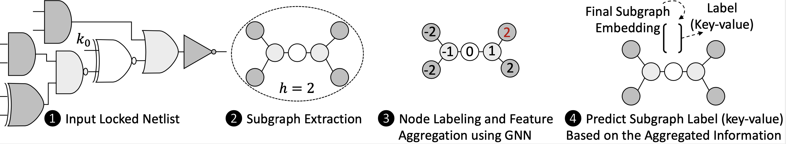

# OMLA: An Oracle-less Machine Learning-based Attack on Logic Locking
## Contact Info
This repository is the official implementation of the experiments in the following paper:

L. Alrahis, S. Patnaik, M. Shafique and O. Sinanoglu, "OMLA: An Oracle-less Machine Learning-based Attack on Logic Locking," in *IEEE TCAS II: Express Briefs*, doi: 10.1109/TCSII.2021.3113035.

[IEEE Link](https://ieeexplore.ieee.org/document/9539868) 

**Contact**

Lilas Alrahis (lma387@nyu.edu)
## Citation
If you make use of the code/experiment or OMLA algorithm in your work, please cite our paper (Bibtex below).
```
@ARTICLE{9539868,
  author={Alrahis, Lilas and Patnaik, Satwik and Shafique, Muhammad and Sinanoglu, Ozgur},
  journal={IEEE Transactions on Circuits and Systems II: Express Briefs}, 
  title={{OMLA}: An Oracle-less Machine Learning-based Attack on Logic Locking}, 
  year={2021},
  pages={1-1},
  doi={10.1109/TCSII.2021.3113035}}
```
## Overview 
OMLA is an oracle-less attack on traditional logic locking which maps the problem of resolving the key-bit value to subgraph classification. OMLA extracts a small subgraph for each key-gate from the locked netlist. The enclosing subgraphs capture the characteristics associated with the key-bit values of the key-gates. Therefore, the label of a subgraph can also be considered the key-bit value.



## Requirement
Install PyTorch following the instuctions on the [official website] (https://pytorch.org/).
Then install the other dependencies (tqdm, numpy, and networkx)

## Netlist-to-subgraphs Conversion
### Datasets
The `./circuit_datasets/` directory contains an example dataset for the `c3540` benchmark. The dataset is implemented using the self-referencing scenario explained in the TCAS-II paper. The target `c3540` circuit is locked using random logic locking with K=64 and then re-synthesized using `Synopsys Design Compiler`. The target circuit is named `Test_c3540_syn_locked_rnd_64_1_syn.v`. The training/validation circuits are obtained by re-locking the test circuit with additional 64 key-bits and re-synthesizing.
When creating a dataset, the files used for training, validation, or testing must be identified. To split files into Test/Train/Validate, the files must be named accordingly. A locked file must be named as follows: [Test|Train|Validate]_*.v

### Conversion to Graphs
**Scripts**  
The following scripts are required for the conversion:  
`./TheCircuit.pm`: a Perl module we create to ease circuit's parsing. This module is required by our parser `netlist_to_subgraphs.pl`

`./netlist_to_subgraphs.pl` perl script reads the circuit dataset and converts the circuits into a single graph. The script also identifies the key-gates and the corresponding key-bit values, which will be used to train/test the GNN-based attack model. The circuits are expected to follow the Nangate 45nm Open Cell Library format. The script assigns unique numerical IDs (0 to N-1) to the nodes (gates). N represents the total number of nodes (gates) in the dataset. The list of nodes corresponding to the key-gates with a key-bit value of `0` in the training set will be dumped in `node_tr_pos.txt`, and the key-gates with a key-bit value of `1` will be dumped in `node_tr_neg.txt`. The list of key-gates in the testing set with a key-bit value of `0` will be dumped in `node_te_pos.txt`, while the ones with a key-bit value of `1` will be dumped in `node_te_neg.txt`. Same applies for the validation set. The extracted features will be dumped in `feat.txt`. The existence of an edge i between two vertices u and v is represented by the entry of ith line in `link.txt` (representing u's and v's IDs).

**Running the Conversion**   
1) Modify line 7 in `./netlist_to_subgraphs.pl` and place the full path to `theCircuit.pm`.
2) Perform the conversion:  
    ```sh
    $ cd ./circuit_datasets/
    $ unzip c3540.zip
    $ cd ../
    $ perl netlist_to_subgraphs.pl -f c3540 -i ./circuit_datasets/c3540   > log_build_OMLA_c3540.txt
    ```
The corresponding graph dataset will be dumped under ./data

## Subgraph Classification
To train the GIN network on the generated dataset:
```sh
$ python Main.py --split-val --use-dis --save-model --file-name c3540 --links-name link.txt  --batch_size 64  --filename Release_c3540_result_b64_h2_fan_6layers_hd64.txt  --hidden_dim 64 --num_layers 6 > Release_log_c3540_b64_h2_6layers_hd64.txt
```
**Training/Attacking Configuration**

The `--use-dis` flag enables the distance encoding proposed in the TCAS-II paper. If this flag is not set, distance encoding will not be performed.

The `--split-val` flag will combine the extracted subgraphs from the training and the validation circuits, randomly shuffle the subgraphs and select 10% for validation. If this flag is not set, the validation set will be obtained directly from the specified validation circuit. 

It is highly recommended that a grid search is used to find the optimal hyperparameters of OMLA for a specific dataset. The hyperparameters include the hidden dimension, number of layers, and batch size.

To load the saved model and dump predictions:
```sh
$ python Main.py --split-val --use-dis --only-predict --file-name c3540 --links-name link.txt  --batch_size 64 --hidden_dim 64 --num_layers 6 > Release_predict_log_c3540_b64_h2_6layers_hd64.txt
```
    
## Acknowledgement
OMLA utilizes the graph isomorphism network (GIN) GNN architecture from the following paper:
Keyulu Xu, Weihua Hu, Jure Leskovec and Stefanie Jegelka, "How Powerful are Graph Neural Networks?", *ICLR*, 2019. 
We owe many thanks to the authors for making their GIN code available.

